# Mermaid Syntax Reference

## Syntax Compatibility Rules

These 5 rules prevent parser errors across common rendering tools (GitHub, Obsidian, VS Code extensions):

1. **Subgraphs**: use `subgraph "Title"` — NOT `subgraph ID["Title"]` (named subgraphs require mermaid ≥10.3)
2. **Diamond nodes**: always give an explicit ID — `DECISION{"text"}` — NOT anonymous `{"text"}` after `-->`
3. **Line breaks**: `\n` works inside `["text"]`; avoid `\n` inside `{"text"}` — keep diamond labels single-line
4. **Sequence notes**: plain text only — no ` `, ` `, or other HTML tags
5. **Special characters**: replace `&` with `and` to avoid HTML entity issues

## Core Syntax

Every diagram starts with a type declaration on the first line:

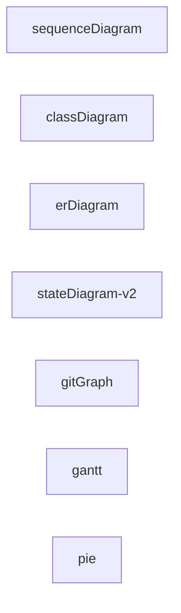

Use `%%` for comments. Indentation improves readability but isn't required.

## Flowchart

### Node shapes

| Syntax | Shape |
|---|---|
| `A[text]` | Rectangle |
| `A(text)` | Rounded rectangle |
| `A([text])` | Stadium / pill |
| `A[[text]]` | Subroutine |
| `A[(text)]` | Database / cylinder |
| `A((text))` | Circle |
| `A{text}` | Rhombus / decision |
| `A{{text}}` | Hexagon |
| `A>text]` | Asymmetric / flag |
| `A[/text/]` | Parallelogram |
| `A[\text\]` | Parallelogram (reverse) |
| `A[/text\]` | Trapezoid |

### Edges

| Syntax | Type |
|---|---|
| `A --> B` | Arrow |
| `A --- B` | Link (no arrow) |
| `A -.-> B` | Dotted arrow |
| `A ==> B` | Thick arrow |
| `A -->\|label\| B` | Labeled arrow (preferred) |
| `A -- label --> B` | Labeled arrow (alt) |

### Subgraphs

Always use quoted titles:

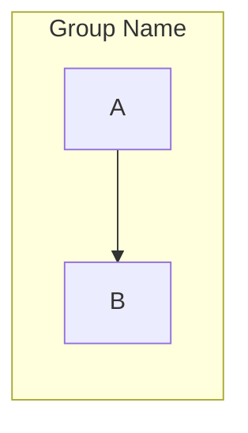

### Example

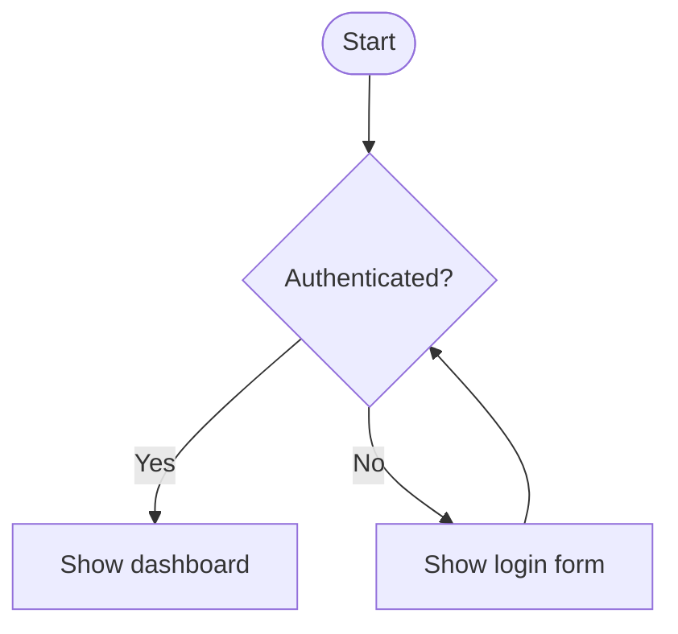

## Sequence Diagram

### Participants

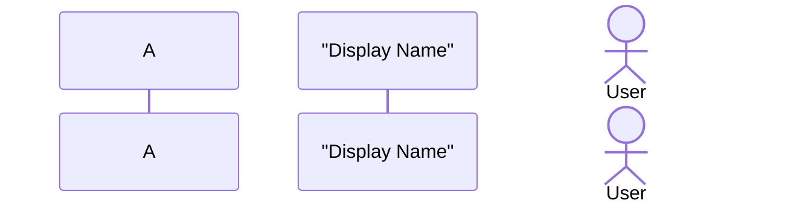

### Messages

| Syntax | Type |
|---|---|
| `->>` | Synchronous call |
| `-->>` | Synchronous response |
| `-)` | Asynchronous call |
| `--)` | Asynchronous response |
| `-x` | Delete / loss |

### Structure blocks

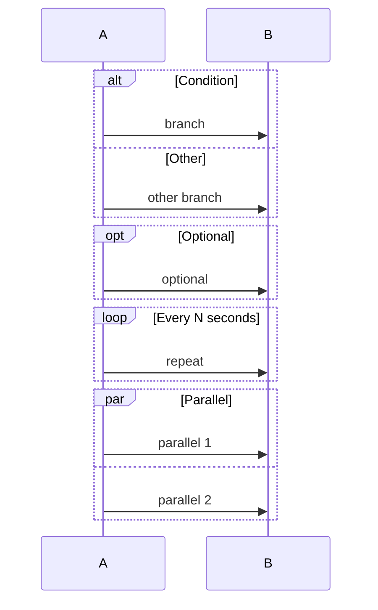

### Notes

Plain text only — no HTML tags:

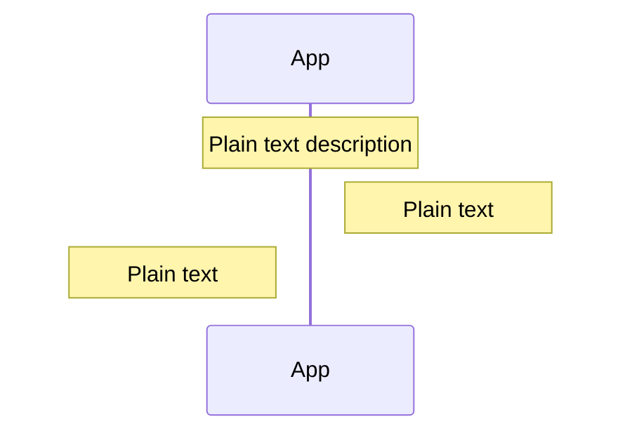

### Example

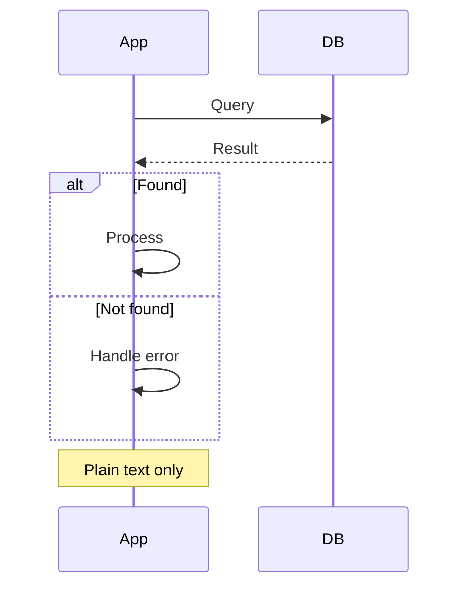

## Class Diagram

### Class declaration

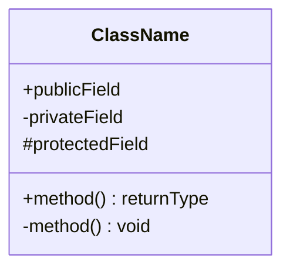

### Relationships

| Syntax | Relationship |
|---|---|
| `<\|--` | Inheritance |
| `*--` | Composition |
| `o--` | Aggregation |
| `-->` | Association |
| `..\|>` | Realization |
| `..>` | Dependency |
| `--` | Link |

Multiplicity: `"1" --> "*"`

### Example

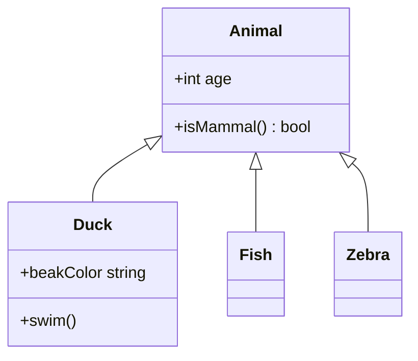

## Entity-Relationship Diagram

### Cardinality

| Symbol | Meaning |
|---|---|
| `\|o` | Zero or one |
| `\|\|` | Exactly one |
| `}o` | Zero or more |
| `}\|` | One or more |

### Example

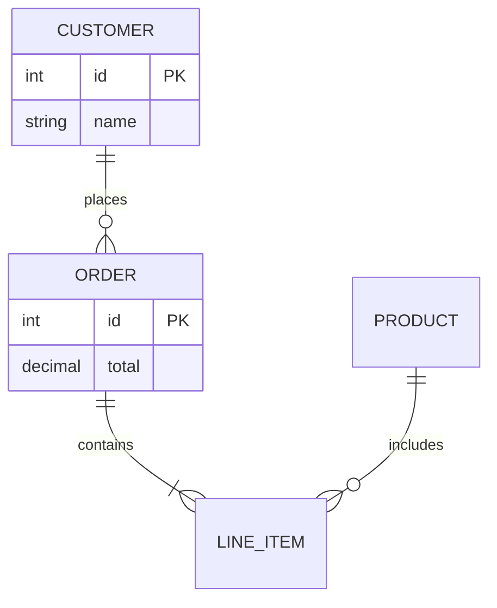

## State Diagram

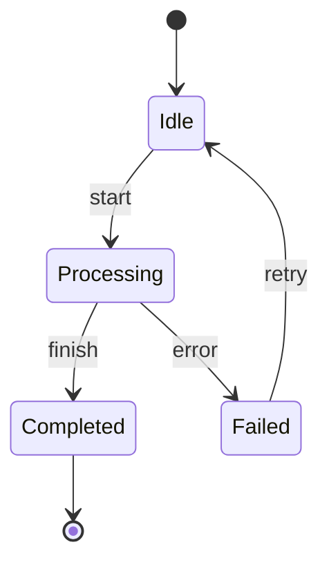

Composite states:

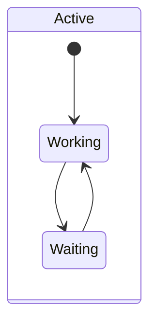

## C4 Diagram

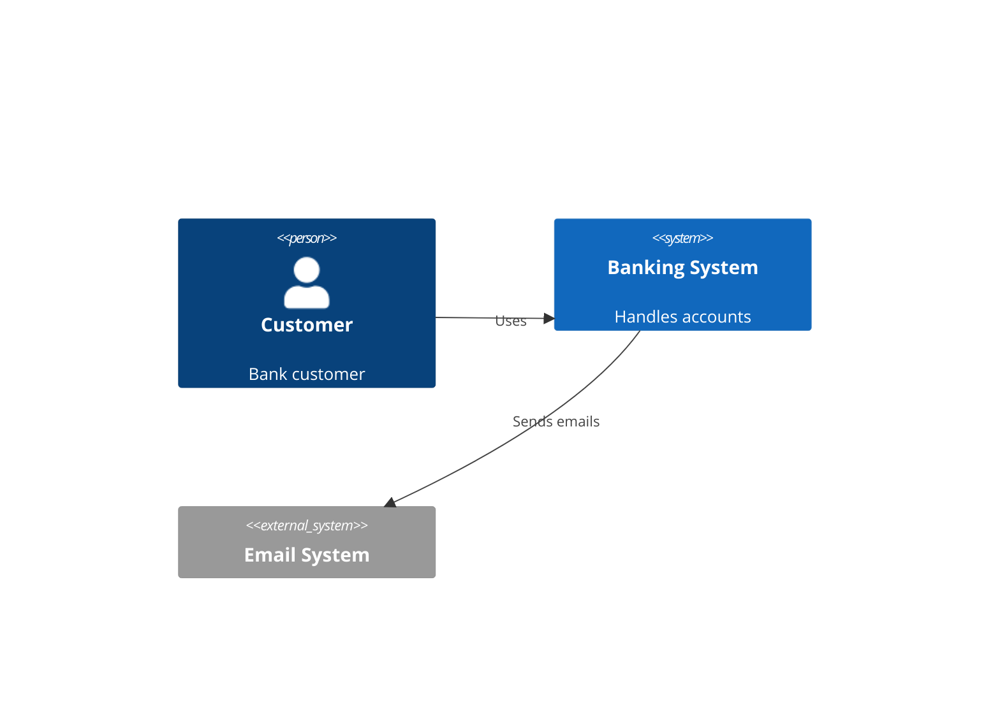

Other levels: `C4Container`, `C4Component`, `C4Deployment`.

Boundaries: `System_Boundary(name, "Label") { ... }`, `Container_Boundary`, etc.

## Git Graph

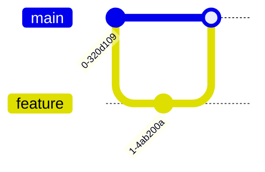

## Gantt Chart

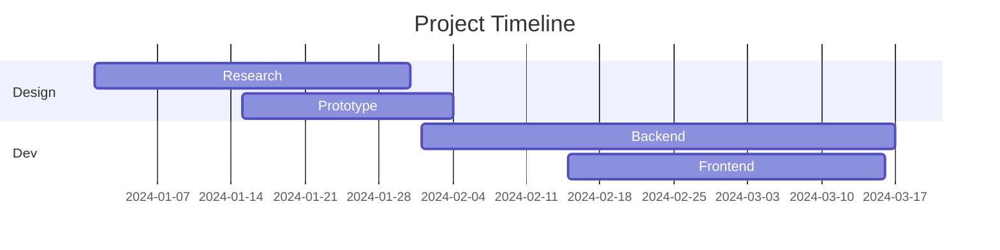

## Pie Chart

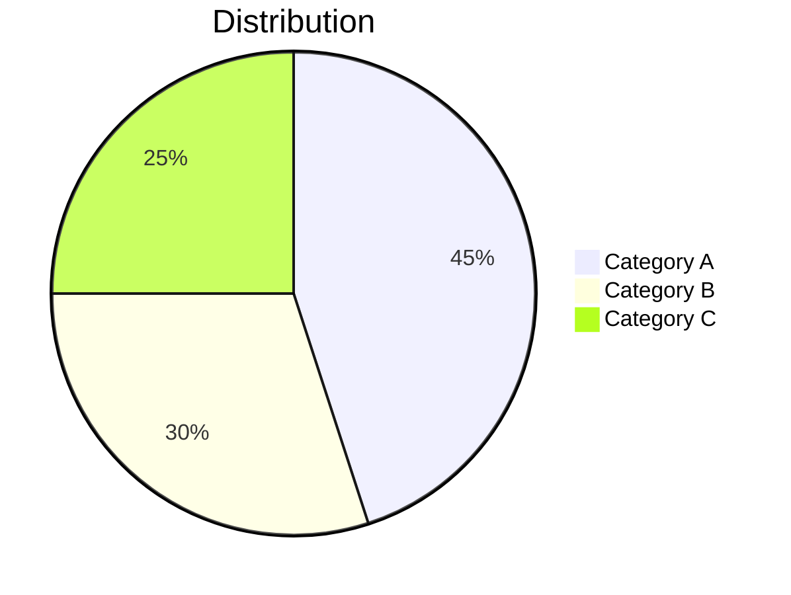

## Common Pitfalls

- **Subgraph syntax**: `subgraph Name["Label"]` fails in many renderers — use `subgraph "Label"` instead
- **Anonymous diamond nodes**: `-->{"text"}` causes parse errors — use `--> DECISION{"text"}` with an explicit ID
- **HTML in sequence notes**: ` ` renders literally — use plain text
- **`\n` in diamonds**: `{"line1\nline2"}` is not supported — keep text single-line
- **`&` character**: triggers HTML entity issues — write `and` instead
- **Unclosed brackets**: every `[`, `(`, `{` needs a matching closing bracket
- **Unknown words**: misspellings break diagrams; validate at https://mermaid.live

## Best Practices

1. **Start simple** — build up complexity incrementally
2. **Use action-oriented labels** — "Process payment" not "Payment"
3. **One concept per diagram** — split complex systems into focused views
4. **Validate syntax** — test in mermaid.live before committing
