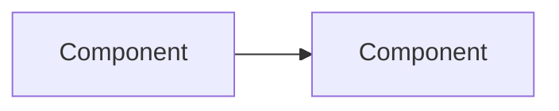

# Architecture Brief (architecture-brief)

This skill generates an architecture overview document from a PR or local git diff — explaining **what was built** and **how it works**. It detects the forge from the current repo and adapts accordingly.

## When to skip

Do **not** generate a brief for:
- Bug fixes (PR closes an issue with a patch)
- Small changes (< 100 lines)
- Pure refactors with no behavioral change
- Documentation-only PRs
- Dependency bumps

If unsure, generate the brief — it's cheap and useful.

## Workflow

### 1. Determine mode

Parse the user's input:

| Input | Mode | Description |
|---|---|---|
| `pr brief #<N>`, `architecture-brief PR #<N>` | **PR** | Analyze a specific PR |
| `architecture-brief` | **Local** (unstaged) | Analyze current unstaged diff |
| `architecture-brief --staged`, `git brief --cached` | **Local** (staged) | Analyze staged changes only |
| `architecture-brief --output <path>` | any | Override output path |
| `git brief --since <ref>` | **Local** (range) | Analyze diff from `<ref>` to HEAD |

If both a PR number and a local diff context exist, PR mode wins.

### 2. Detect forge (PR mode only)

Load the `forge-detect` skill. It detects the repository's forge
and sets `$FORGE_CLI`, `$FORGE_TYPE`, and `$FORGE_HOST`. Use the
command templates from `forge-detect` for PR info, diff, and files.

If the forge CLI is not installed, fall back to the PR's web API or
local-diff mode. If the forge CLI is installed but not authenticated,
fall back to local-diff mode and note it to the user.

### 3. Gather input

#### PR mode

1. Fetch PR info (title, description, changed files count) using `$FORGE_CLI`
2. Save the diff using the PR diff command from `forge-detect`
3. Create a worktree:
   ```bash
   git fetch origin "pull/<N>/head:arch-brief-pr-<N>"
   git worktree add ../arch-brief-pr-<N> arch-brief-pr-<N>
   ```
4. Read the diff to understand scope and identify key new files

#### Local mode

1. Get branch name: `git branch --show-current`
2. Get the diff:
   - Unstaged: `git diff > /tmp/arch-brief.diff`
   - Staged: `git diff --cached > /tmp/arch-brief.diff`
   - Range: `git diff <ref>..HEAD > /tmp/arch-brief.diff`
3. Read the diff to understand scope
4. No worktree needed — files are in the current working tree

### 4. Analyze architecture

Read the diff and identify:

1. **New modules/directories** — new packages, subdirectories, or files that form a cohesive unit
2. **New data models** — database tables, schemas, Pydantic models
3. **New API endpoints or CLI commands** — routes, entry points, background workers
4. **New infrastructure patterns** — outbox, CQRS, event sourcing, background jobs, caching
5. **New configuration** — environment variables, feature flags, settings

For each, read the relevant source files from the worktree (PR mode) or working tree (local mode) to understand how they work.

### 5. Generate the brief

Build the output path:

- If `--output <path>` was provided, use it directly
- Otherwise:
  - PR mode: `docs/pr-<N>-arch.md`
  - Local mode: `docs/<branch-name>-arch.md`

Save to the resolved path with this structure:

```markdown
# <Title> Architecture

<Context line: PR #<N> | branch <name>, <date>, +/- line stats>

## Overview

<2-3 paragraphs. What problem does this solve? What are the key design
decisions?>

## Key concepts

<Explain the core domain concepts introduced. Use subheadings.>

### <Concept 1>

<How it works, why it exists, what problem it solves.>

### <Concept 2>

...

## Data flow

<Use Mermaid diagrams. Choose the type that best fits:

- **flowchart** for component relationships and routing
- **sequenceDiagram** for request/response flows
- **stateDiagram-v2** for state machines



> Include a caption explaining what the diagram shows.
>

## Configuration

<New settings introduced. Use a table.>

| Setting | Default | Purpose |
|---|---|---|
| `ENV_VAR` | `value` | Description |

Include only new configuration — not pre-existing settings.

## API / CLI surface

<New public entry points. Use a table.>

| Type | Path / Name | Auth | Purpose |
|---|---|---|---|
| endpoint | `GET /api/v1/foo` | token | List foos |
| worker | `APP_ROLE=worker` | — | Background processor |

Include only what this PR adds.

## Limitations

<Known trade-offs, edge cases not handled, planned follow-ups.>

- <Item 1>
- <Item 2>
```

### Mermaid diagrams

When generating Mermaid diagrams, also load the `mermaid-syntax` skill for syntax rules that prevent parser errors.

### 6. Present to user

Display the generated brief content, then ask:

> What would you like to do with this architecture brief?
> 1. **Save as doc** — writes to `<resolved path>`
> 2. **None** — discard

### 7. Cleanup

If a worktree was created (PR mode):

```bash
git worktree remove ../arch-brief-pr-<N>
git branch -D arch-brief-pr-<N>
rm -f /tmp/arch-brief-<N>.diff
```

Skip cleanup if the user asks to keep the worktree for further work.
